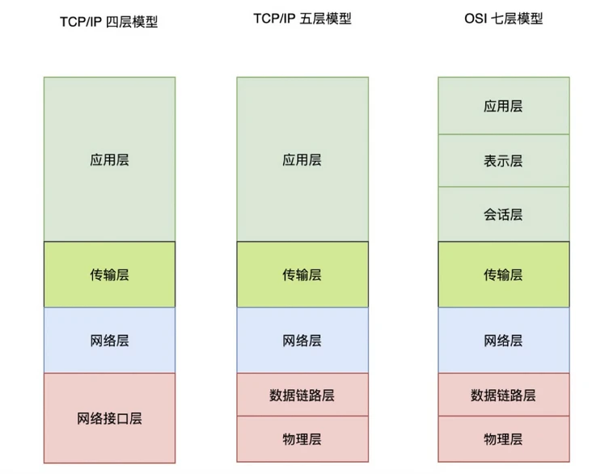
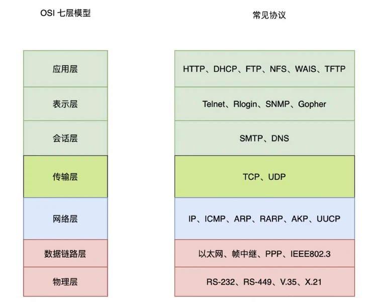
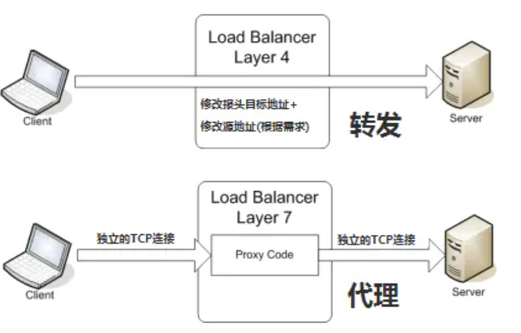

## 四层代理和七层代理
日常看文章，是时不时会遇到两个概念"四层代理负载均衡"和"七层代理负载均衡"，
本文介绍下这两个概念和使用场景。

## OSI七层模型
要聊几层代理，需要先看一下网络分层，在之前的文章中也提到，标准的七层网络分层，
也就是 OSI 七层模型。TCP/IP 五层模型和 TCP/IP 四层模型都是从 OSI 七层优化而来。

这里所谈的四层代理和七层代理，便是基于 OSI 七层模型来划分的。

从下往下看，第四层为传输层，第七层为应用层。再看看每层对应的常见协议：

四层对应的是 TCP/UDP 协议，也就常说的 IP + 端口。七层已经是非常具体的应用层协议了，
因此所谓四层就是基于 IP + 端口的负载均衡；七层就是基于 URL 等应用层信息的负载均衡；

同理，还有基于 MAC 地址的二层负载均衡和基于 IP 地址的三层负载均衡。
- 二层负载均衡通过一个虚拟 MAC 地址接受请求，然后再分配到真实的 MAC 地址；
- 三层负载均衡通过一个虚拟 IP 地址接受请求，然后再分配到真实的 IP 地址。

## 四层代理
四层代理主要工作与 OSI 模型中的传输层，传输层主要处理消息的传递，而不管消息的内容。
TCP 就是常见的四层协议。

四层负载均衡只针对由上游服务发送和接受的网络包，而不检查包内的具体内容是什么。
四层负载均衡可以通过检查 TCP 流中的前几个包，从而决定是否限制路由。因此，
四层负载均衡的核心就是 IP + 端口层面的负载均衡，不涉及具体的报文内容。

## 七层代理
七层代理主要工作于 OSI 模型的应用层，应用层主要用来处理消息内容的。比如，HTTP 便是常见的七层协议。
七层负载均衡服务器起到了反向代理的作用，Client 端要先与七层负载均衡设备三次握手建立 TCP 连接，
把要访问的报文信息发送给七层负载均衡。

七层负载均衡器基于消息中内容( 比如 URL 或者 cookie 中的信息 )来做出负载均衡的决定。
之后，七层负载均衡器建立一个新的 TCP 连接来选择上游服务并向这个服务发出请求。

使用七层负载均衡的设备经常被用于反向代理。

## 两者区别
先通过一张图来看看四层代理和七层代理的区别：

上图中最直观的区别是四层代理只进行了一次 TCP 请求，而七层代理进行了两次 TCP 请求。

四层代理：四层代理拆解成报文至传输层，根据请求的服务为 IP + 端口号进行转发；
四层代理是由后端服务器进行处理，包括报文的封装都是后端服务器进行封装；四层代理相当于是一个路由器。

七层代理：七层代理拆解报文至应用层，分析用户请求的资源，然后负载均衡器会代替用户请求后端服务器的资源；
后端服务器把资源返回给负载均衡器，负载均衡器对资源再次进行封装，然后返还给客户端；
在此过程中，需要建立两次 TCP 连接，一次是客户端，一次是后端的服务器。

